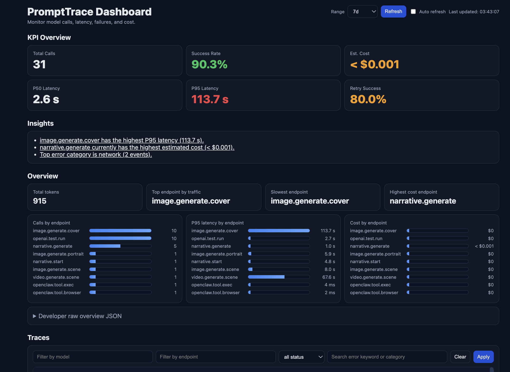
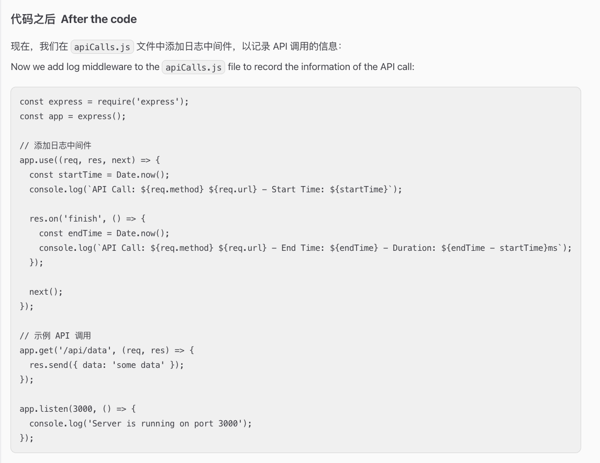

# PromptTrace

A structured personal AI workspace for running **OpenClaw** with memory, persona, and operational guardrails.

## Overview

PromptTrace is a lightweight repository that keeps assistant behavior, user context, and session memory in versioned files so interactions are consistent across restarts.

It is organized around:

- **Identity & behavior** (assistant voice, boundaries, working style)
- **User context** (preferences and relevant background)
- **Session continuity** (daily memory logs + long-term notes)
- **Operational guidance** (heartbeat checks, tooling notes, bootstrap flow)

## Repository Structure

```text
.
├── AGENTS.md        # Workspace operating rules and memory policy
├── SOUL.md          # Assistant persona and behavior principles
├── USER.md          # User profile/preferences (editable)
├── IDENTITY.md      # Assistant identity metadata
├── TOOLS.md         # Local environment/tooling notes
├── HEARTBEAT.md     # Periodic check instructions
├── BOOTSTRAP.md     # First-run onboarding instructions
├── memory/          # Daily session memory files
└── .learnings/      # Captured learnings/errors/feature notes
```

## Use Cases

- Maintain a persistent assistant persona
- Keep conversational continuity across sessions
- Track decisions and context in plain text
- Build a transparent, auditable assistant workflow

## Getting Started

1. Clone the repository.
2. Open it as your OpenClaw workspace.
3. Update `USER.md` and `IDENTITY.md` for your setup.
4. Add daily notes under `memory/YYYY-MM-DD.md`.
5. Curate long-term patterns into a separate `MEMORY.md` (optional).

## Recommended Hygiene

Before publishing publicly, add a `.gitignore` and remove machine-specific/private artifacts, for example:

- `.DS_Store`
- `.Rhistory`
- `.openclaw/workspace-state.json`
- private memory or learning logs

## Screenshot Setup

Add your screenshots to `assets/screenshots/` with these filenames so they render directly under the title:

- `1.png`
- `2.png`
- `3.png`





## License

No license is currently specified. Add one (for example, MIT) if you want others to reuse this project.
