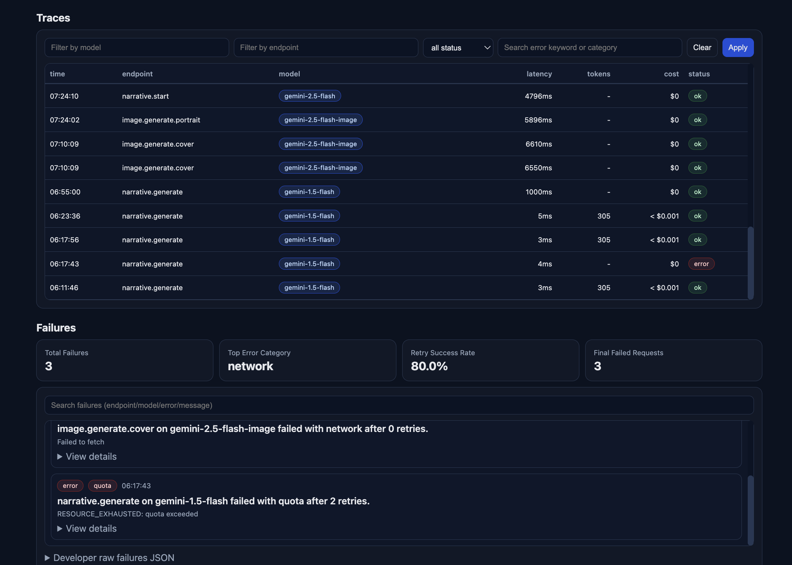
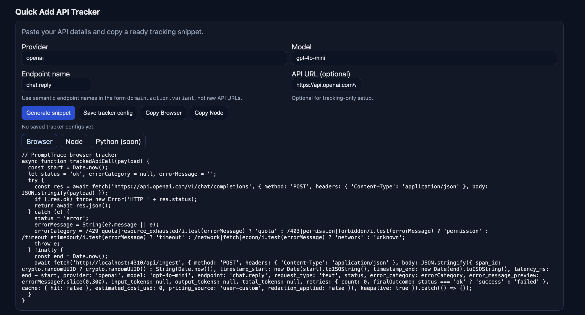

# PromptTrace

PromptTrace gives LLM apps a black-box recorder: every model call is traced and analyzed for cost, latency, and reliability.

## Screenshots





## ✅ MVP status (Day 1 → Day 7)

- JSONL trace collector (`.prompttrace/traces.jsonl`)
- SDK wrapper: `withTrace(...)`
- Error taxonomy: `quota | permission | network | timeout | parse | unknown`
- Retry helper: `withRetry(...)` with backoff metadata
- Cost estimation + pricing source versioning
- Aggregator: totals, success rate, P50/P95, by endpoint/model/day
- Failures view: error breakdown + retry success rate
- Traces query with filters
- Local dashboard server (`/api/overview`, `/api/traces`, `/api/failures`, `/api/openclaw`, `/api/ingest`)
- OpenClaw usage tracker (`prompttrace openclaw -- ...`)
- Trace rotation/retention (`prompttrace rotate --keep-lines 5000`)
- Exporters: JSON + Markdown report

## Install

```bash
npm install
npm run build
```

## CLI

```bash
# Overview metrics
node dist/index.js analyze --range 7d

# Raw traces (filterable)
node dist/index.js traces --range 7d --status error --limit 50

# Failures report
node dist/index.js failures --range 7d

# Export report
node dist/index.js export --format md --range 7d
node dist/index.js export --format json --range 7d

# Dashboard
node dist/index.js dashboard --port 4310
# then open http://localhost:4310

# Track OpenClaw command usage
node dist/index.js openclaw --endpoint openclaw.tool.exec -- openclaw status

# Keep trace file bounded
node dist/index.js rotate --keep-lines 5000
```

## Example integration

```ts
import { withTrace } from './sdk/trace.js';
import { withRetry } from './sdk/retry.js';

const { result, retries } = await withRetry(() => geminiCall(prompt), { maxRetries: 2, baseDelayMs: 400 });

await withTrace(
  {
    provider: 'gemini',
    model: 'gemini-1.5-flash',
    endpoint: 'narrative.generate',
    requestType: 'text',
    prompt,
    responsePreview: result.text,
    retries
  },
  async () => result
);
```

## Privacy defaults

- Default stores prompt preview (truncated) + hash, not full prompt
- Basic redaction masks email/phone/key-like patterns
- Full prompt logging requires `PROMPTTRACE_FULL=1`
- Logs stay local; delete `.prompttrace/` to clear data

## Output files

- `.prompttrace/traces.jsonl`
- `.prompttrace/REPORT.json`
- `.prompttrace/REPORT.md`

## Dashboard pages mapping

- **Overview:** KPI cards + full aggregate JSON
- **Traces:** filter by model/endpoint/status/error_category
- **Failures:** error category counts + recent failure list + retry effectiveness

## Architecture Overview

This project follows a modular structure with clear separation between interface, execution logic, and outputs/artifacts. The exact implementation details vary by repository, but the intent is to keep core logic testable and easy to extend.


## Project Structure

```text
.
├─ src/            # Core source code (if present)
├─ public/         # Static assets / UI resources (if present)
├─ docs/           # Documentation and notes (if present)
├─ scripts/        # Utility scripts (if present)
├─ test/           # Tests (if present)
└─ README.md       # Project overview
```

> Folder names vary by project; this section describes the intended organization pattern.


## Quick Start

1. Clone the repository
2. Install dependencies (if any)
3. Run the project using its local start/build instructions

If this repo is a library or static project, refer to scripts/config files for exact commands.


## Current Scope

This repository reflects the project’s current implementation and active direction. Planned improvements are tracked through issues/commits and may evolve over time.

